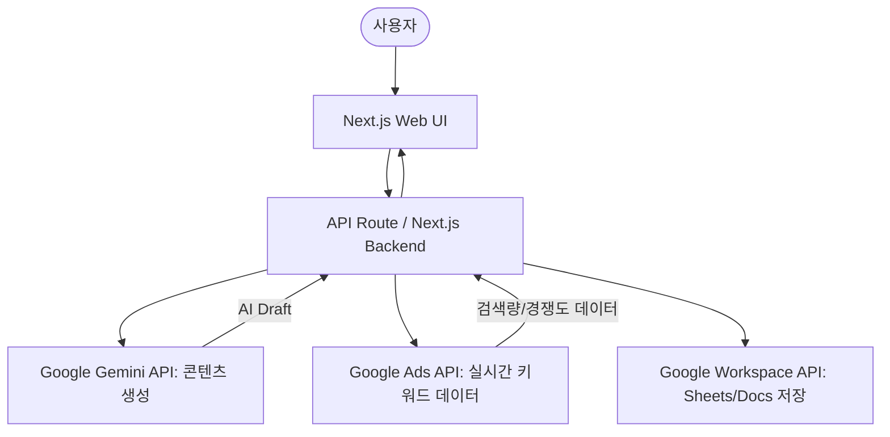

# [Project Proposal] SEO Antigravity: AI 기반 SEO 콘텐츠 자동화 플랫폼

## 1. 프로젝트 개요 (Executive Summary)
**SEO Antigravity**는 최신 AI 기술(Google Gemini)과 데이터 기반의 키워드 분석을 결합하여, 마케터와 콘텐츠 크리에이터가 최소한의 노력으로 고도화된 SEO 최적화 블로그 콘텐츠를 생산할 수 있도록 돕는 자동화 플랫폼입니다.

본 프로젝트는 현재 사용자 인터페이스(UI), AI 콘텐츠 생성 로직, Google Drive(Docs/Sheets) 연동이 모두 완료된 상태이며, **마지막 단계로 Google Ads API를 통한 실시간 검색 트래픽 및 경쟁도 데이터 연동**을 앞두고 있습니다.

---

## 2. 핵심 기능 및 워크플로우 (Core Functionality)
플랫폼은 총 5단계의 원스톱 프로세스로 운영됩니다.

1.  **강의 및 소구점 입력 (Input)**: 타겟 고객, 강의명, 핵심 소구점(USP)을 입력합니다.
2.  **데이터 기반 키워드 추출 (Keyword Discovery)**: 
    *   *현재*: AI 기반 키워드 추천
    *   *전환 계획*: **Google Ads API**를 연동하여 실제 월간 검색량(Search Volume) 및 경쟁도(Competition) 데이터를 기반으로 키워드를 선별합니다.
3.  **주제 기획 및 구조화 (Topic Planning)**: 선택된 키워드를 바탕으로 AI가 최적의 목차와 주제를 기획합니다.
4.  **AI 콘텐츠 생성 (Content Generation)**: Gemini 2.0 Flash를 활용하여 가독성과 SEO 점수가 높은 고품질 글을 생성합니다.
5.  **자동 발행 및 관리 (Archiving)**: 생성된 글을 Google Docs로 저장하고, Google Sheets로 실시간 관리 대장을 업데이트합니다.

---

## 3. 기술 스택 (Technical Stack)
| 구분 | 기술 | 설명 |
| :--- | :--- | :--- |
| **Frontend/Backend** | Next.js 14 (App Router) | 고성능 서버 사이드 렌더링 및 API Route 활용 |
| **AI Support** | Google Gemini 2.0 Flash | 자연어 처리 및 콘텐츠 맥락 이해 |
| **Storage/Collaboration** | Google Sheets & Docs API | 콘텐츠 자동 저장 및 관리 시스템 |
| **Infrastructure** | Vercel | 빠른 배포 및 확장성 확보 |
| **Keyword Data** | **Google Ads API (Integration Pending)** | 실제 검색량 및 광고 경쟁도 데이터 확보용 |

---

## 4. Google Ads API 활용 목적 (Business Use Case)
본 프로젝트에서 Google Ads API는 서비스의 **신뢰도와 데이터 정확성**을 확보하기 위한 핵심 요소입니다.

1.  **실시간 트래픽 데이터 확보**: 추측성 키워드가 아닌, 구글 검색 엔진에서 실제로 발생하는 검색 트래픽 데이터를 사용자에게 제공합니다.
2.  **키워드 아이디어 확장**: 사용자가 입력한 시드 키워드와 연관된 고효율(High-Value) 키워드 조합을 추출합니다.
3.  **경쟁도 분석**: SEO 난이도를 사전에 파악하여, 광고비 대비 효율적인 유입을 기대할 수 있는 'Low-Hanging Fruit' 키워드를 전략적으로 추천합니다.

---

## 5. 프로젝트 완성도 및 로드맵 (Status & Roadmap)

### ✅ 현재 완료된 항목 (Status: POC & Prototype Ready)
- 반응형 다크 모드 UI 패키지 (Modern Dashboard Design)
- Gemini API 기반의 콘텐츠 생성 파이프라인 구축
- Google Sheets/Docs API를 통한 자동 아카이빙 기능 구현
- 사용자 입력 기반의 단계별 워크플로우 UI 전환 로직

### 🚀 Google Ads API 연동 후 계획 (Roadmap)
- **Phase 1**: `KeywordPlanIdeaService` 연동을 통한 실시간 검색량 데이터 UI 노출
- **Phase 2**: 키워드 경쟁 점수를 기반으로 한 AI 콘텐츠 전략 고도화 (SEO 가이드라인 강화)
- **Phase 3**: 멀티 랭귀지 지원을 통한 글로벌 SEO 시장 확장

---

## 6. 시스템 아키텍처 다이어그램 (Architecture)

---
본 문서는 SEO Antigravity 프로젝트의 기술적 완성도와 Google Ads API 연동의 필요성을 설명하기 위해 작성되었습니다.
